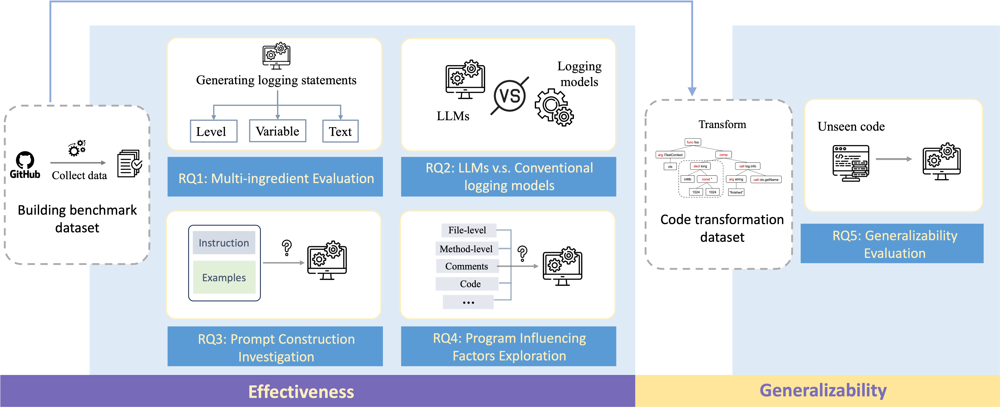

# LogBench

**LogBench is a benchmark for evaluating logging statement generation.** 

Logging statements are imperative in modern software. They serve important role in reflecting developer's intention, recording system behavior, and guiding failure diagnosis procedure. LogBench provides a benchmark and toolkit, allowing you to measure your own models and conveniently compare them with existing baseline models.


If you find our paper benefit your research, please kindly cite our following paper:

+ Yichen Li, Yintong Huo, Zhihan Jiang, Renyi Zhong, Pinjia He, Yuxin Su, Lionel C. Briand, and Michael R. Lyu. [Exploring the Effectiveness of LLMs in Automated Logging Generation: An Empirical Study](https://arxiv.org/abs/2307.05950), arXiv preprint, 2024.

## Study overview


The study is fully described in this [paper](https://arxiv.org/abs/2307.05950). LogBench comprises two subsets for evaluating the model's *effectiveness* and *generalizability*, respectively:

1. Effectiveness: **LogBench-O** contains a collection of high-quality logging statements and their associated code contexts.
2. Generalizability: **LogBench-T** is an unseen code dataset, after semantically-equivalent code transformation from LogBench-O.

Additionally, LogBench offers various variants to support different settings in logging statement generation, including:

* Method-level 
* File-level 
* Comment-included
* Comment-free

## Repository organization 
We currently provide part of the code in the folder `/src`. We will release the full source code after the paper has been accepted.

* LogBench-O: The `/LogBench-O` folder contains the sampled files for LogBench-O.
* LogBench-T: The `/LogBench-T` folder contains the sampled files for LogBench-T.
* Cases: Please refer to the `cases` folder for the generated cases.

# 

```
├── LICENSE
├── LogBench-O
│   ├── LogBench-O_prefix_1point.zip
│   ├── LogBench-O_prefix_1point_file_level.zip
│   └── LogBench-O_prefix_1point_wo_comments.zip
├── LogBench-T
│   ├── LogBench-T_prefix_1point.zip
│   └── LogBench-T_prefix_1point_file_level.zip
├── README.md
├── build
│   └── code-transformer.jar
├── cases
│   └── generated_cases.csv
├── img
│   ├── overview.pdf
│   └── overview.png
└── src
    ├── Baselines
    │   ├── DeepLV
    │   ├── WhichVar
    │   ├── LogenText-Plus
    │   ├── StarCoder
    │   └── Lance
    │   └── InCoder
    │   └── ...
    ├── CodeTransformer
    │   └── README.md
    └── DataCollector
        ├── ...
```


## Study subjects
| 11 LLMs        | Access | Paper reference |
| ------------ | ------ | ---- |
| Davinci      | API    | [Project](https://platform.openai.com/docs/models) |
| ChatGPT      | API    | [Project](https://platform.openai.com/docs/models) |
| LANCE        | Model  | [ICSE'22] [Using deep learning to generate complete log statements](https://dl.acm.org/doi/abs/10.1145/3510003.3511561) |
| InCoder      | Model  | [ICLR'23] [InCoder: A Generative Model for Code Infilling and Synthesis](https://openreview.net/forum?id=hQwb-lbM6EL) |
| Llama2      | Model    | [Llama 2: Open Foundation and Fine-Tuned Chat Models](https://arxiv.org/abs/2307.09288) |
| StarCoder      | Model    | [StarCoder: may the source be with you!](https://arxiv.org/abs/2305.06161) |
| CodeLlama      | Model    | [Code Llama: Open Foundation Models for Code](https://arxiv.org/abs/2308.12950) |
| CodeGeex     | Plugin | [CodeGeeX: A Pre-Trained Model for Code Generation with Multilingual Evaluations on HumanEval-X](https://arxiv.org/abs/2303.17568) |
| TabNine      | Plugin | - |
| Copilot      | Plugin | - |
| Code Whisperer | Plugin | - |
| **Non-LLMs** | |
| DeepLV      | Model    | [ICSE'21] [DeepLV: Suggesting Log Levels Using Ordinal Based Neural Networks](https://ieeexplore.ieee.org/abstract/document/9402068) |
| WhichVar      | Model    | [TSE'21] [Which Variables Should I Log?](https://ieeexplore.ieee.org/document/8840982) |
| LoGenText-Plus        | Model  | [TSE'23] [LoGenText-Plus: Improving Neural Machine Translation Based Logging Texts Generation with Syntactic Templates](https://dl.acm.org/doi/10.1145/3624740) |


## Download original crawling logging dataset
As GitHub does not hold large datasets, you can download the **whole** collected logging dataset Fullsize at [here](https://drive.google.com/file/d/13EV-rIFEwVrLGnpNIcpF3u9NSOh_gCNM/view?usp=sharing)
(zip: 252M; unzip: 786M).


## Code transformation tool

The folder `/build` contains the built tranformation tool. It will conduct the code tranformation automatically with its eight code transformers.
- To conduct the code transformation in batch:
```
java -jar code-transformer.jar -f ./javafiles/
```
# Citation
```bibtex
@article{li2024exploring,
  title={Exploring the effectiveness of llms in automated logging generation: An empirical study},
  author={Li, Yichen and Huo, Yintong and Jiang, Zhihan and Zhong, Renyi and He, Pinjia and Su, Yuxin and Briand, Lionel C. and Lyu, Michael R},
  journal={arXiv preprint arXiv:2307.05950},
  year={2024}
}
```
For each baseline utilized, we kindly request that please ensure to cite the relevant paper while using the code.
